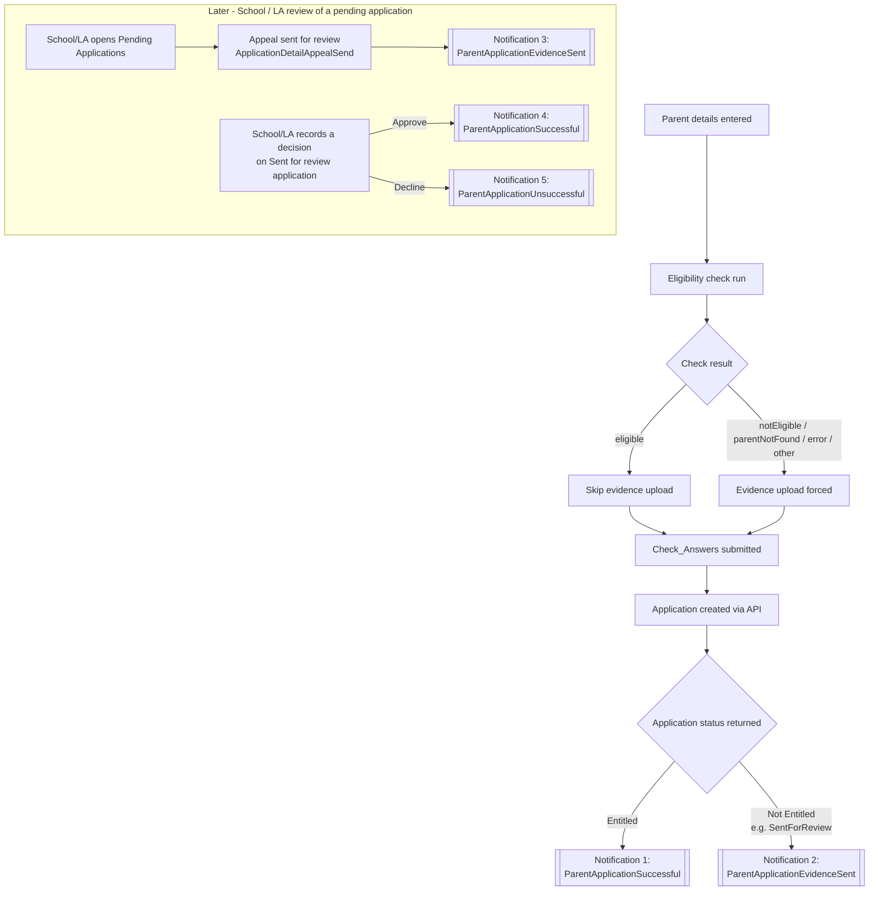
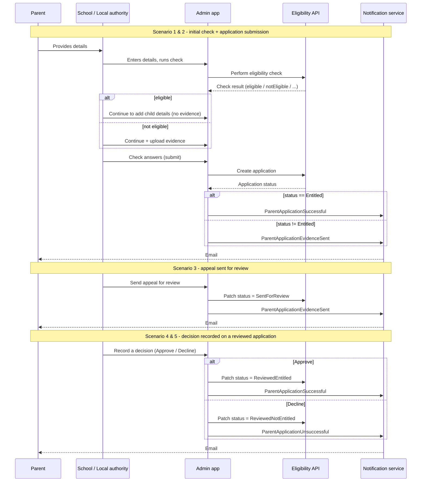

# Parent notification scenarios

This document lists every point in the admin application where an email notification is sent to a
parent/guardian, what triggers it, and which `NotificationType` is used.

Source: `CheckYourEligibility.Admin/Controllers/CheckController.cs` and
`CheckYourEligibility.Admin/Controllers/ApplicationController.cs`.

## Summary table

| # | Trigger (user action) | Controller / action | Decision | Notification sent |
|---|---|---|---|---|
| 1 | Parent/guardian details submitted, check comes back **eligible**, application created with no evidence needed | `CheckController.Check_Answers_Post` | Submitted application status == `Entitled` | `ParentApplicationSuccessful` |
| 2 | Parent/guardian details submitted, check comes back **not eligible** (or any other outcome), evidence attached, application created for review | `CheckController.Check_Answers_Post` | Submitted application status != `Entitled` | `ParentApplicationEvidenceSent` |
| 3 | School/LA sends an appeal application for review with supporting evidence | `ApplicationController.ApplicationDetailAppealSend` | Status patched to `SentForReview` | `ParentApplicationEvidenceSent` |
| 4 | School/LA approves a pending ("Sent for review") application | `ApplicationController.ApplicationApproveSend` | Status patched to `ReviewedEntitled` | `ParentApplicationSuccessful` |
| 5 | School/LA declines a pending ("Sent for review") application | `ApplicationController.ApplicationDeclineSend` | Status patched to `ReviewedNotEntitled` | `ParentApplicationUnsuccessful` |

All notification sends are wrapped in `try/catch`: if sending fails, the error is logged but the
user-facing flow (redirect) still completes.

## Flow diagram

## Sequence view (per scenario)

## Notes / caveats

- The choice between `ParentApplicationSuccessful` and `ParentApplicationEvidenceSent` in
  `Check_Answers_Post` is based on the **application status returned by the API after submission**,
  not the earlier check result. In practice these are correlated (an `eligible` check normally
  leads to `Entitled`; a `notEligible` check normally leads to evidence being required and a
  non-`Entitled` status such as `SentForReview`), but the code itself only inspects the submitted
  application's status.
- `Entitled` is the first (default, value `0`) member of the `ApplicationStatus` enum. If the API
  ever returned an application with an unset/unrecognised status, it would default to `Entitled`
  and would incorrectly trigger `ParentApplicationSuccessful`. This same risk already existed in
  the pre-existing `ApplicationsRegistered` vs `AppealsRegistered` redirect logic.
- There is a fourth `NotificationType` value, `ParentApplicationEvidenceToTakeToSchool`, which is
  defined in `Domain/Enums/NotificationType.cs` but is not currently sent from any controller
  action.
- **Bulk check has no notifications.** `BulkCheckController` (and its use cases) never references
  `ISendNotificationUseCase`/`NotificationRequest`/`NotificationType` anywhere. Only single checks
  (`CheckController`) and application review decisions (`ApplicationController`) trigger parent
  emails; bulk-submitted checks/applications do not notify parents at all today.
